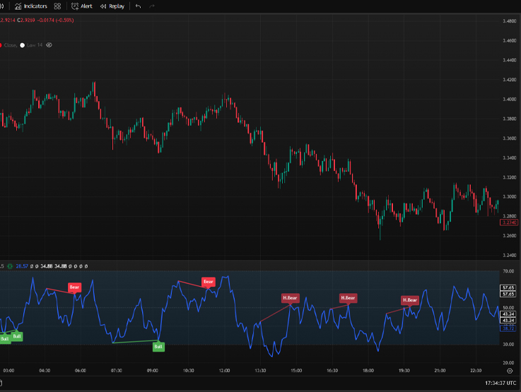
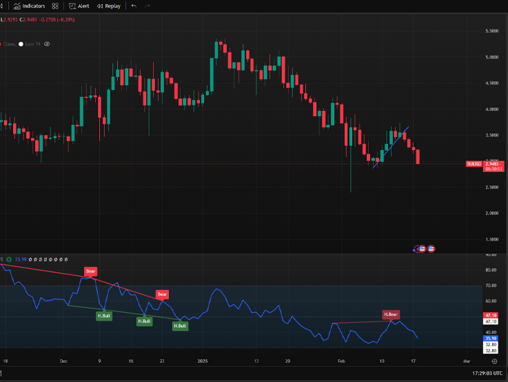
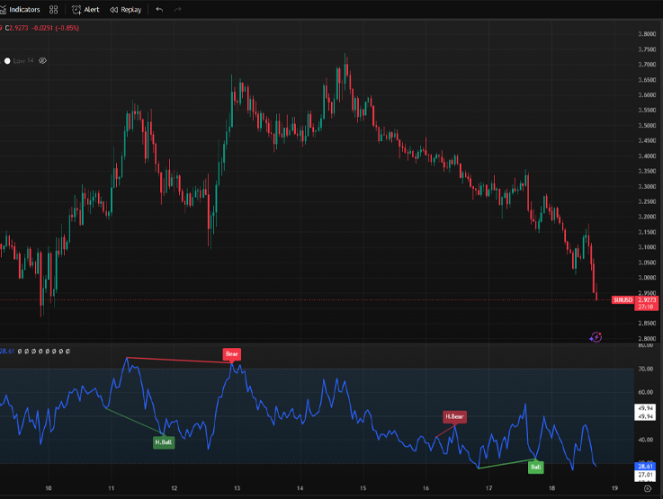

## TradingView Support

 |
--- |
99+ ✔ |

# Enhanced RSI Divergence Indicator
## Preview



## Status

[](https://raw.githubusercontent.com/LeBryere/RSI/master/LICENCE)

# Enhanced RSI Divergence Indicator
## 1. Bevezetés

Ez az indikátor a Relative Strength Index (RSI) divergenciáit keresi a charton, és jelzi azokat vonalakkal és címkékkel (opcionálisan). A divergencia azt jelenti, hogy az árfolyam és az RSI ellentétesen mozog, ami potenciális trendfordulót jelezhet.

## 2. Divergencia típusok

Az indikátor négyféle divergenciát különböztet meg:

1. **Regular Bullish (Szabályos emelkedő):** Az árfolyam alacsonyabb mélypontokat képez, míg az RSI magasabb mélypontokat. Ez egy lehetséges emelkedő trendfordulót jelez.

2. **Hidden Bullish (Rejtett emelkedő):** 2. Az árfolyam magasabb mélypontokat képez, míg az RSI alacsonyabb mélypontokat. Ez a meglévő emelkedő trend folytatódását jelezheti.

3. **Regular Bearish (Szabályos csökkenő):** 3. Az árfolyam magasabb csúcsokat képez, míg az RSI alacsonyabb csúcsokat. Ez egy lehetséges csökkenő trendfordulót jelez.

4. **Hidden Bearish (Rejtett csökkenő):** 4. Az árfolyam alacsonyabb csúcsokat képez, míg az RSI magasabb csúcsokat. Ez a meglévő csökkenő trend folytatódását jelezheti.

## 3. Megjelenítés

**Vonalak**

Az indikátor vonalakat rajzol az RSI panelen, a divergenciák helyén. A vonalak színe a divergencia típusától függ:

   -  Regular Bullish: <span style="color: green;">Zöld </span>
   -  Hidden Bullish: <span style="color: lightgreen;">Halványzöld </span>
   -  Regular Bearish: <span style="color: red;">Piros </span>
   -  Hidden Bearish: <span style="color: #FF6666;">Halványpiros</span>

**Címkék**

Az indikátor opcionálisan címkéket is megjelenít az RSI panel felett (bearish) vagy alatt (bullish), a divergencia típusától függően:
   - Regular Bullish: "Bull"
   - Hidden Bullish: "H.Bull"
   - Regular Bearish: "Bear"
   - Hidden Bearish: "H.Bear"

**RSI vonalak**
Az indikátor megjeleníti az **`RSI vonalát, a középvonalat (50)`**, valamint a **`túlvett (70)`** és **`túladott (30)`** szinteket.



## 4. Beállítások (Inputs)

### RSI Beállítások
1. **RSI Period:** Az RSI periódusa (alapértelmezett: 14). Ez határozza meg, hogy hány gyertyára visszamenőleg számolja ki az RSI-t.
2. **RSI Source:**  Az RSI forrása (alapértelmezett: close). Megadhatod, hogy melyik árfolyam-adatot használja az RSI számításához (pl. close, open, high, low, vagy ezek kombinációja).
3. **Oversold Level:** Túladott szint (alapértelmezett: 30).
4. **Overbought Level:** Túlvett szint (alapértelmezett: 70).

### Divergencia Beállítások
1. **Pivot Lookback Right:**  A pivot pontok kereséséhez használt jobb oldali visszatekintési periódus (alapértelmezett: 5). Ez azt jelenti, hogy a pivot ponttól jobbra hány gyertyának kell alacsonyabbnak/magasabbnak lennie ahhoz, hogy a pont pivot-nak minősüljön.
2. **Pivot Lookback Left:**A pivot pontok kereséséhez használt bal oldali visszatekintési periódus (alapértelmezett: 5). Ez azt jelenti, hogy a pivot ponttól balra hány gyertyának kell alacsonyabbnak/magasabbnak lennie ahhoz, hogy a pont pivot-nak minősüljön.
3. **Max of Lookback Range:** A maximális visszatekintési időszak (alapértelmezett: 60). Az indikátor csak az elmúlt ennyi gyertya között keres divergenciákat.
4. **Min of Lookback Range:** A minimális visszatekintési időszak (alapértelmezett: 5). Az indikátor csak akkor jelez divergenciát, ha a pivot pontok legalább ennyi gyertyára vannak egymástól.

### Divergence Types (Divergencia típusok):
1. **Regular Bullish:** (Alapértelmezett: bekapcsolva / `defval=true`)
    ```bash
    plotBull = input.bool(title="Regular Bullish", defval=true, group=GP3)
    ```
2. **Hidden Bullish:** (Alapértelmezett: bekapcsolva / `defval=true`)
   ```bash
    plotHiddenBull = input.bool(title="Hidden Bullish", defval=true, group=GP3)
    ```
3. **Regular Bearish:** (Alapértelmezett: bekapcsolva / `defval=true`)
   ```bash
   plotBear = input.bool(title="Regular Bearish", defval=true, group=GP3)
    ```
4. **Hidden Bearish:** (Alapértelmezett: bekapcsolva / `defval=true`)
    ```bash
   plotHiddenBear = input.bool(title="Hidden Bearish", defval=true, group=GP3)
    ```

### Visual Settings (Megjelenítési beállítások):
- <span style="color: green;">**Bullish Color:**</span> A bullish divergenciák vonalainak és címkéinek színe (alapértelmezett: <span style="color: green;">zöld </span>).
- <span style="color: red;">**Bearish Color:**</span>  A bearish divergenciák vonalainak és címkéinek színe (alapértelmezett: <span style="color: red;">piros</span>).
- **Show Labels:** Ha be van kapcsolva (alapértelmezett: true), az indikátor címkéket jelenít meg a divergenciák helyén.
- **Label Offset:** Nincs használatban ebben a verzióban.

## 5. Hogyan használd az indikátort?
1. **Add hozzá a chartodhoz.**
2. **Állítsd be a paramétereket** a saját preferenciáid szerint. Különösen fontos a Pivot Lookback Right és Pivot Lookback Left értékek megfelelő beállítása, mert ezek nagyban befolyásolják a pivot pontok megtalálását, és így a divergenciák észlelését.
3. **Figyeld a vonalakat és címkéket.**  Ha az indikátor divergenciát talál, akkor egy vonalat és (opcionálisan) egy címkét fog megjeleníteni az RSI panelen.
4. **Használd a divergenciákat a kereskedési döntéseidben, de ne kizárólag ezekre hagyatkozz!** A divergenciák csak lehetséges jelzések, nem garantált előrejelzések. Mindig használj más indikátorokat, elemzési módszereket és kockázatkezelési szabályokat is.

### 6. Fontos megjegyzések
- A divergenciák nem mindig jelentenek trendfordulót. Előfordulhatnak fals jelzések is.
- A divergenciák hatékonysága függ a piaci körülményektől, az instrumentumtól, az időtávtól és az indikátor beállításaitól.
- A rejtett divergenciák (Hidden Bullish/Bearish) a meglévő trend folytatódását jelzik, míg a szabályos divergenciák (Regular Bullish/Bearish) a trend fordulását.
- A divergenciák kereskedése tapasztalatot igényel. Érdemes először demó számlán, vagy kis tétekkel gyakorolni.
- Ez a kód a @version=6 -ot használja, ami nem létezik. Használd a @version=5-öt

### 7. Összegzés
Az Enhanced RSI Divergence indikátor segít azonosítani az árfolyam változásának potenciális fordulópontjait az RSI divergenciák segítségével. Különböző beállításokkal testreszabható, és figyelmeztetéseket küld a kereskedési lehetőségekről.

*`Használat előtt érdemes demo számlán tesztelni, hogy jobban megértsd a jelzéseit és integrálhasd saját stratégiádba.`*

## License

<span style="color: red;">Please respect the license terms of any libraries used.</span>

### Enhanced RSI Divergence Indicator



## Status

[](https://raw.githubusercontent.com/LeBryere/RSI/master/LICENCE)
